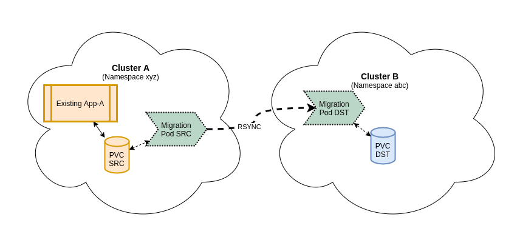

# Migrate PV Contents Between Clusters

**Use case:** Migrate/Copy contents of a PV in one cluster to a PV in a separate cluster.



> This process creates several temporary objects in your openshift namespaces.

## Assumptions

`Edit` Access to a pre-existing OpenShift namespace on *Cluster A*

  - deploymentConfig or other application deployment (to be scaled down)
  - Existing PVC (source)

`Edit` Access to a namespace within *Cluster B*

  - Service account and token with `deployer` access.
  - Pre-Created PVC suited for the destination (size/storageClass/etc)

[Step Overview](#Step-Overview)

[Walkthrough](#Sample-Walkthrough)

[Database data](#Database-data)

## Step Overview

- Confirm pre-requisites (assumptions) have been met.
- Ensure the migration image is available in both clusters/namespaces.
Cluster B (Destination)
- Ensure any application pods in Cluster B with DST PVC mounted are scaled down.
- Start migration pod in Cluster B (destination) with DST PVC mounted to /target
- Create remote access service account in Cluster B (Optional)
Cluster A (Source)
- Create remote access secret for Cluster B in Cluster A - namespace xyz
- Scale down any applications accessing the SRC and DST PVC's
- Start migration pod in Cluster A (source) with SRC PVC mounted to /source and the remote-access secret mounted to dest-secret

In a shell session in the migration pod (Cluster A):
- authenticate to remote cluster using dest-secret credentials
- get remote migration podname
- rsync from source to remotePod:/target


## Sample Walkthrough

For this sample, the source/target clusters have been reversed to accomodate pending firewall changes for the lab environments.  Specifically, outgoing traffic from pathfinder lab to klab is pending approval.  This traffic has been confirmed for Pathfinder Production to Silver production environments.

### Variables:

| **Source Cluster** | KLab |
| ----- | ----- |
| **namespace** | jefkel-tools |
| **pvc name** | x-cluster-klab-1 |
| **token secret name** | x-cluster-test |
| | |

| **Destination Cluster** | Pathfinder Lab |
| ----- | ----- |
| **API URL**| https://console.lab.pathfinder.gov.bc.ca:8443 |
| **namespace** | jefkel-dev |
| **destination PVC name** | x-cluster-plab-1 |
| **auth token** | \<Optional, or from service account secret\> |
| | |

### Detailed Steps:

1. Create variables file (./cross-cluster/tester.env)
``` yaml
# configure destination templates
DESTINATION_PVC=x-cluster-plab-1
DST_IMAGE_NAMESPACE=jefkel-tools
#
# configure source templates
SOURCE_PVC=x-cluster-klab-1
REMOTE_CLUSTER=https://console.lab.pathfinder.gov.bc.ca:8443
REMOTE_PROJECT=jefkel-dev
REMOTE_SECRET=x-cluster-test
#
# Defaults are reversed, so need to override here:
DST_IMAGE_REGISTRY=docker-registry.default.svc:5000
SRC_IMAGE_REGISTRY=image-registry.openshift-image-registry.svc:5000
```

2. Login to Destination Cluster (pathfinder lab, namespace jefkel-dev)
``` bash
oc process -f ./openshift/templates/pvc-migrator-build.yaml | oc apply -f - -n jefkel-dev
# Confirm image with :latest tag exists and is the recent build.
oc get is pvc-migrator
```

3. Deploy template manifests to create deployment, service account and rolebinding.
``` bash
oc process -f ./cross-cluster/target-migrator-tmpl.yaml \
  --param-file=cross-cluster/tester.env \
  --ignore-unknown-parameters=true | oc apply -f - -n jefkel-dev
```

4. Get token for remote secret value and create secret manifest for source (shortcut below)
``` bash
MIG_TOKEN_SECRET=`oc get secret | jq '.items[] | select(.type == "kubernetes.io/service-account-token") | .metadata.name' | grep target-pvc-migrator-token | head -1 | awk '{print $1}'`
# Use token value to generate local temp secret
oc create secret generic x-cluster-test --from-literal=token=`oc get secret ${MIG_TOKEN_SECRET} -o json | jq -r .data.token | base64 -d` --dry-run=client -o json > tmp.secret
```

5. Login to Source Cluster (klab: namespace jefkel-tools) and create secret
``` bash
oc apply -n jefkel-tools -f ./tmp.secret; rm ./tmp.secret
oc label secret x-cluster-test base=xc-pvc-migrator
```

6. Build migrator pod (if required)
``` bash
oc process -f ./openshift/templates/pvc-migrator-build.yaml | oc apply -f - -n jefkel-tools
# Confirm image with :latest tag exists and is the recent build.
oc get is pvc-migrator
```

7. Deploy templated manifests to create deployment
``` bash
oc process -f ./cross-cluster/source-migrator-tmpl.yaml \
  --param-file=cross-cluster/tester.env \
  --ignore-unknown-parameters=true | oc apply -f - -n jefkel-tools
```

8. Connect to source pod and push data
> NOTE: the `--kubeconfig=...` is required, otherwise you'll likely get unauthorized errors

``` bash
# rsh to migration pod:
oc rsh `oc get pods | grep source-pvc-migrator | awk '{print $1}'`
# set target pod name:
MIG_POD_TARGET=`oc --kubeconfig=/target/tkube/KUBECONFIG get pods | grep target-pvc-migrator | awk '{print $1}'`
# use above target pod to run the rsync:
cd /source; oc rsync --compress=true --kubeconfig=/target/tkube/KUBECONFIG . ${MIG_POD_TARGET}:/target
```

9. Scale down deployments
> This allows re-running the data copy at a future time just by scaling up source and destination, and re-running the rsync.
``` bash
# login to source cluster
oc scale --replicas=0 deployment/source-pvc-migrator

# login to target cluster
oc scale --replicas=0 deployment/target-pvc-migrator
```

10. Cleanup steps:
Cleanup of deployed objects can be done with label selectors:
``` bash
# Cleanup deployment objects
oc delete -l base=xc-pvc-migrator deployment,sa,rolebinding,secret
# Cleanup build details
oc delete -l app=pvc-migrator build,buildconfig,is
```

## Database data

Specific callout for database data.  A reliable approach for DB data migration could be:

1. backup your source DB on the source cluster
2. copy the DB backup PVC to the remote cluster (using [Step Overview](#Step-Overview) )
3. perform a DB restore to a target DB service on the remote cluster.
